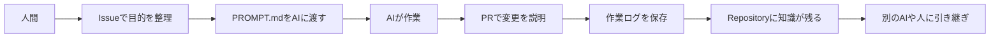
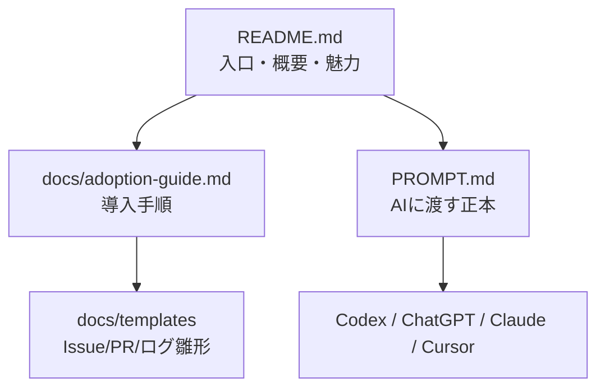
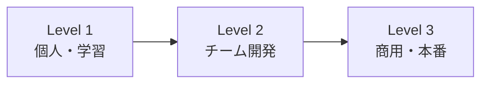

# AI Native Development Template

AIと一緒に、安全・継続的・再現可能に開発するためのRepositoryテンプレート

<p align="center">
  <strong>AIに開発を任せっぱなしにせず、作業・判断・ログ・PRをRepositoryに残すための開発プロトコルです。</strong>
</p>


## AI開発で、こんな困りごとはありませんか？

- AIに何を頼んだか分からなくなる
- 会話履歴が消えると作業を再開できない
- PRやIssueの説明がバラバラになる
- 別のAIや人に引き継げない
- 商用利用に必要な確認が抜ける
- 変更理由が残らず、後からレビューできない

このテンプレートは、それらを防ぐために、AIへの依頼・作業ログ・判断理由・PR/Issue運用をRepositoryに残す仕組みを提供します。

## 30秒で分かるこのRepository

| 項目 | 内容 |
|---|---|
| これは何？ | AIと開発するときのルール・記録・テンプレート集 |
| 誰向け？ | AI初心者、学生、個人開発者、非エンジニア、チーム開発者 |
| 何ができる？ | AIへの依頼、作業ログ、PR/Issue運用、判断記録を標準化 |
| 最初に読むもの | README.md |
| 導入手順 | docs/adoption-guide.md |
| AIに渡すもの | PROMPT.md / PROMPT.txt |

## まず読むべき3つ

1. [README.md](README.md)  
   全体像を理解する入口です。
2. [docs/adoption-guide.md](docs/adoption-guide.md)  
   自分のRepositoryへ導入する手順です。
3. [PROMPT.md](PROMPT.md)  
   Codex・ChatGPT・Claude・CursorなどのAIに渡す正本です。

コピペしやすいテキスト版は [PROMPT.txt](PROMPT.txt) です。

## 全体像

初心者向けに、まずは「Issueで目的を整理 → AIに実装依頼 → PRで説明 → ログを残す」という流れを覚えればOKです。



このRepositoryの役割分担は明確です。READMEは入口、導入手順はadoption-guide、AI実行ルールはPROMPT.mdです。



導入は一気に全部ではなく、Level 1 → Level 2 → Level 3 と段階的に進めます。



## 特徴

- AI依頼の標準化（PROMPT.md / PROMPT.txt）
- 作業ログとAIプロンプトログの保存
- PR / Issue / Discussion / commit message の日本語運用
- ADRによる重要判断の記録
- 商用運用へ拡張しやすい段階設計

## Before / After

| Before | After |
|---|---|
| AIへの依頼が毎回バラバラ | PROMPT.mdで依頼を標準化 |
| 会話履歴にしか情報がない | Repositoryに作業ログが残る |
| PR説明が薄い | PRテンプレートで説明がそろう |
| なぜ決めたか分からない | ADRで判断理由が残る |
| 別AIへ引き継げない | Issue/ログ/プロンプトで再開できる |

## 導入レベル

| Level | 向いている人 | 使うもの | ゴール |
|---|---|---|---|
| Level 1 | 個人開発・学生・AI初心者 | PROMPT.md / Issue / 作業ログ | AIと安全に作業を始める |
| Level 2 | チーム開発 | docs/core / .github / scripts | PR/Issue/ログ運用を統一 |
| Level 3 | 商用・本番運用 | commercial readiness / security / release | 顧客提供・監査・運用に備える |

詳細手順は [docs/adoption-guide.md](docs/adoption-guide.md) を参照してください。

## Quick Start

1. [docs/adoption-guide.md](docs/adoption-guide.md) で導入レベルを選ぶ
2. [PROMPT.md](PROMPT.md) と [PROMPT.txt](PROMPT.txt) を確認する
3. 最初のIssueを作る
4. `PROMPT.md + Issue URL + 作業内容` をAIへ渡す
5. PR作成時に作業ログ・AIプロンプトログ・必要ならADRを更新する

## AIに依頼するときの例

```text
このRepositoryのPROMPT.mdに従って作業してください。

対象Issue:
{{ISSUE_URL}}

作業内容:
{{TASK_DESCRIPTION}}

必ず守ること:
- PR本文は日本語
- commit messageは日本語
- 作業ログを保存
- AIプロンプトログを保存
- 重要判断はADRへ保存
```

## 主なファイルと役割

| ファイル | 役割 |
|---|---|
| README.md | 入口・魅力・概要・最初の使い方 |
| docs/adoption-guide.md | 導入手順・移行手順・具体例 |
| PROMPT.md | AIに渡す正本・実行ルール |
| PROMPT.txt | PROMPT.mdのコピペ版 |
| docs/templates/ | Issue/PR/ログ/ADRの雛形 |
| docs/core/ | チーム運用・商用運用の詳細ルール |
| docs/examples/ | 想定ユースケースと導入例 |

## 導入事例・使い方の例

### 例1: 学生の個人開発
Todoアプリやポートフォリオ制作で、AIに作業を依頼しながらIssueと作業ログを残す。  
使うファイル: `PROMPT.md`, `docs/adoption-guide.md`, `docs/templates/work-log-template.md`

### 例2: 非エンジニアのプロダクト企画
作りたい機能をIssueに整理し、AIへ実装依頼するための共通ルールとして使う。  
使うファイル: `PROMPT.txt`, `docs/templates/sample-japanese-issue.md`（相当テンプレート）, `docs/examples/use-cases.md`

### 例3: 小規模チーム開発
PR/Issue/Discussion/commit messageを日本語で統一し、レビューしやすくする。  
使うファイル: `docs/adoption-guide.md`, `.github/`, `docs/core/`

### 例4: 商用サービス準備
セキュリティ、リリース、障害対応、サポート準備をチェックする。  
使うファイル: `docs/core/commercial-readiness.md`, `docs/core/security-rules.md`, `docs/core/release-management-rules.md`

詳細なケースは [docs/examples/use-cases.md](docs/examples/use-cases.md) と [docs/examples/adoption-examples.md](docs/examples/adoption-examples.md) を参照してください。

## 図解・スクリーンショット

現在はMermaid図を中心に掲載しています。今後、導入例やGitHub上のIssue/PR運用例のスクリーンショットは `docs/assets/screenshots/` に追加していきます。

- 資産ガイド: [docs/assets/README.md](docs/assets/README.md)
- 図解置き場: [docs/assets/diagrams/README.md](docs/assets/diagrams/README.md)
- スクリーンショット置き場: [docs/assets/screenshots/README.md](docs/assets/screenshots/README.md)

## GitHub日本語運用ポリシー

- PR / Issue / Discussion / commit message は日本語を基本とする
- 変更理由と完了条件を明記する
- AI出力をそのまま採用せず、人間レビューとテストを必須にする

## 用語集

- **ADR**: 重要な技術判断を記録するドキュメント
- **作業ログ**: いつ、何を、なぜ行ったかの履歴
- **AIプロンプトログ**: AIに渡した依頼文の履歴
- **導入レベル**: 個人→チーム→商用へ段階的に進めるための運用単位

## 注意点

- READMEに情報を詰め込みすぎず、詳細はdocsへ分離する
- 存在しない画像リンクを貼らない
- 実績がない誇大表現（導入企業多数など）を書かない

## 次にやること

1. [docs/adoption-guide.md](docs/adoption-guide.md) で自分の導入レベルを選ぶ
2. [PROMPT.md](PROMPT.md) をAIへ渡して初回タスクを依頼する
3. 最初のIssue・PR・作業ログを作る

## ライセンス

MIT
