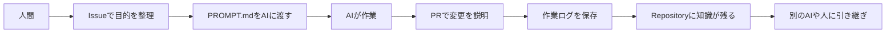
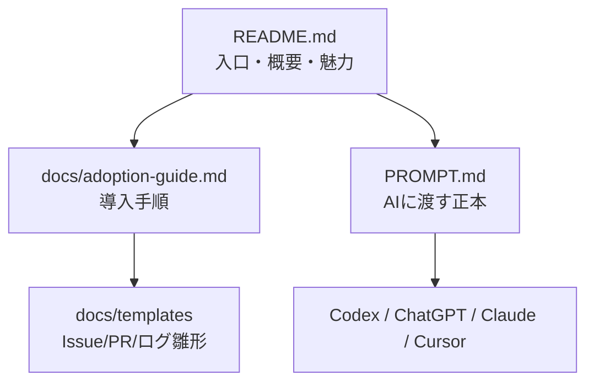

# AI Native Development Template

AIと一緒に、安全・継続的・再現可能に開発するためのRepositoryテンプレート

<p align="center">
  <strong>AIに開発を任せっぱなしにせず、作業・判断・ログ・PRをRepositoryに残すための開発プロトコルです。</strong>
</p>


## AI開発で、こんな困りごとはありませんか？

- AIに何を頼んだか分からなくなる
- 会話履歴が消えると作業を再開できない
- PRやIssueの説明がバラバラになる
- 別のAIや人に引き継げない
- 商用利用に必要な確認が抜ける
- 変更理由が残らず、後からレビューできない

このテンプレートは、AIへの依頼・作業ログ・判断理由・PR/Issue運用をRepositoryに残す仕組みを提供します。

## 30秒で分かるこのRepository

| 項目 | 内容 |
|---|---|
| これは何？ | AIと開発するときのルール・記録・テンプレート集 |
| 誰向け？ | AI初心者、学生、個人開発者、非エンジニア、チーム開発者 |
| 何ができる？ | AIへの依頼、作業ログ、PR/Issue運用、判断記録を標準化 |
| 最初に読むもの | README.md |
| 導入手順 | docs/adoption-guide.md |
| AIに渡すもの | PROMPT.md / PROMPT.txt |

## まず読むべき3つ

1. [README.md](README.md)  
   全体像を理解する入口です。

2. [docs/adoption-guide.md](docs/adoption-guide.md)  
   自分のRepositoryへ導入するための手順書です。

3. [PROMPT.md](PROMPT.md)  
   Codex・ChatGPT・Claude・CursorなどのAIに渡す正本です。

コピペしやすいテキスト版は [PROMPT.txt](PROMPT.txt) です。

## 全体像

まずは「Issueで目的整理 → AIへ依頼 → PRで変更説明 → ログ保存」の流れを押さえればOKです。



README / adoption-guide / PROMPT.md の役割分担は次のとおりです。



## 特徴

### 🤖 1. AIへの依頼を標準化できる
毎回ゼロから説明しなくても、PROMPT.mdを渡せば基本ルールを共有できます。

### 📝 2. 作業ログを残せる
何をしたか、なぜそうしたかをRepositoryに残せます。

### 🇯🇵 3. GitHub運用を日本語で統一できる
PR、Issue、Discussion、commit messageを日本語でそろえられます。

### 🔁 4. 別のAIや人に引き継ぎやすい
会話履歴ではなくRepositoryに情報が残るため、作業を再開しやすくなります。

### 🛡 5. 商用利用に必要な観点を忘れにくい
セキュリティ、リリース、障害対応、サポート準備などを段階的に確認できます。

## Before / After

| Before | After |
|---|---|
| AIへの依頼が毎回バラバラ | PROMPT.mdで依頼を標準化 |
| 会話履歴にしか情報がない | Repositoryに作業ログが残る |
| PR説明が薄い | PRテンプレートで説明がそろう |
| なぜ決めたか分からない | ADRで判断理由が残る |
| 別AIへ引き継げない | Issue/ログ/プロンプトで再開できる |

## 導入レベル

| Level | 向いている人 | 使うもの | ゴール |
|---|---|---|---|
| Level 1 | 個人開発・学生・AI初心者 | PROMPT.md / Issue / 作業ログ | AIと安全に作業を始める |
| Level 2 | チーム開発 | docs/core / .github / scripts | PR/Issue/ログ運用を統一 |
| Level 3 | 商用・本番運用 | commercial readiness / security / release | 顧客提供・監査・運用に備える |

詳細は [docs/adoption-guide.md](docs/adoption-guide.md) を参照してください。

## Quick Start

1. [docs/adoption-guide.md](docs/adoption-guide.md) を読む
2. 導入レベルを選ぶ
3. [PROMPT.md](PROMPT.md) をAIに渡す
4. Issueを1つ作る
5. 作業ログを残す
6. PRを作る

詳しい手順は [docs/adoption-guide.md](docs/adoption-guide.md) を参照してください。

## AIに依頼するときの例

```text
このRepositoryのPROMPT.mdに従って作業してください。

対象Issue:
{{ISSUE_URL}}

作業内容:
{{TASK_DESCRIPTION}}

必ず守ること:
- PR本文は日本語
- commit messageは日本語
- 作業ログを保存
- AIプロンプトログを保存
- 重要判断はADRへ保存
```

置き換え方:
- `{{ISSUE_URL}}`: 例 `https://github.com/your-org/your-repo/issues/123`
- `{{TASK_DESCRIPTION}}`: 例 `ログイン画面のバリデーションとテストを追加`

## 主なファイルと役割

| ファイル | 役割 |
|---|---|
| README.md | 入口・概要・魅力・最初の使い方 |
| docs/adoption-guide.md | 導入手順・移行手順・具体例 |
| PROMPT.md | AIに渡す正本・実行ルール |
| PROMPT.txt | PROMPT.mdのコピペ版 |
| docs/templates/ | Issue/PR/ログ/ADRの雛形 |

## 導入事例・使い方の例

- 学生の個人開発: `PROMPT.md` と `docs/templates/` を使って、小さなIssue単位で継続開発
- 非エンジニアの企画検証: `PROMPT.txt` と `docs/adoption-guide.md` を使って依頼手順を固定
- 小規模チーム開発: `.github/` と `docs/core/` でPR/Issue運用を統一
- 商用サービス準備: `docs/core/commercial-readiness.md` などで本番前チェックを段階導入

詳細は次を参照してください。
- [docs/examples/use-cases.md](docs/examples/use-cases.md)
- [docs/examples/adoption-examples.md](docs/examples/adoption-examples.md)

## 図解・スクリーンショット

現在はMermaid図を中心に掲載しています。

今後、導入例やGitHub上のIssue/PR運用例のスクリーンショットは以下に追加できます。

- [docs/assets/diagrams/](docs/assets/diagrams/)
- [docs/assets/screenshots/](docs/assets/screenshots/)

スクリーンショットを追加する場合は、個人情報・secret・token・顧客情報が含まれていないことを確認してください。

## GitHub日本語運用ポリシー

- PR / Issue / Discussion / commit message は日本語運用で統一
- 変更理由と完了条件を必ず記載
- AIの出力は人間レビューとテストを通して採用する

## 用語集

- **ADR**: 重要な設計判断の記録（後から理由を追えるようにする文書）
- **作業ログ**: 何を・いつ・なぜ行ったかを残す履歴
- **AIプロンプトログ**: AIに渡した指示文の履歴

## 注意点

- READMEは入口として保ち、詳細は `docs/` に分離する
- 存在しない画像リンクを貼らない
- 実績がない誇大表現（例: 導入企業多数）を書かない

## 次にやること

1. [docs/adoption-guide.md](docs/adoption-guide.md) で導入レベルを決める
2. [PROMPT.md](PROMPT.md) をAIへ渡して最初のタスクを依頼する
3. 最初のIssue・PR・作業ログを作る

## ライセンス

MIT
