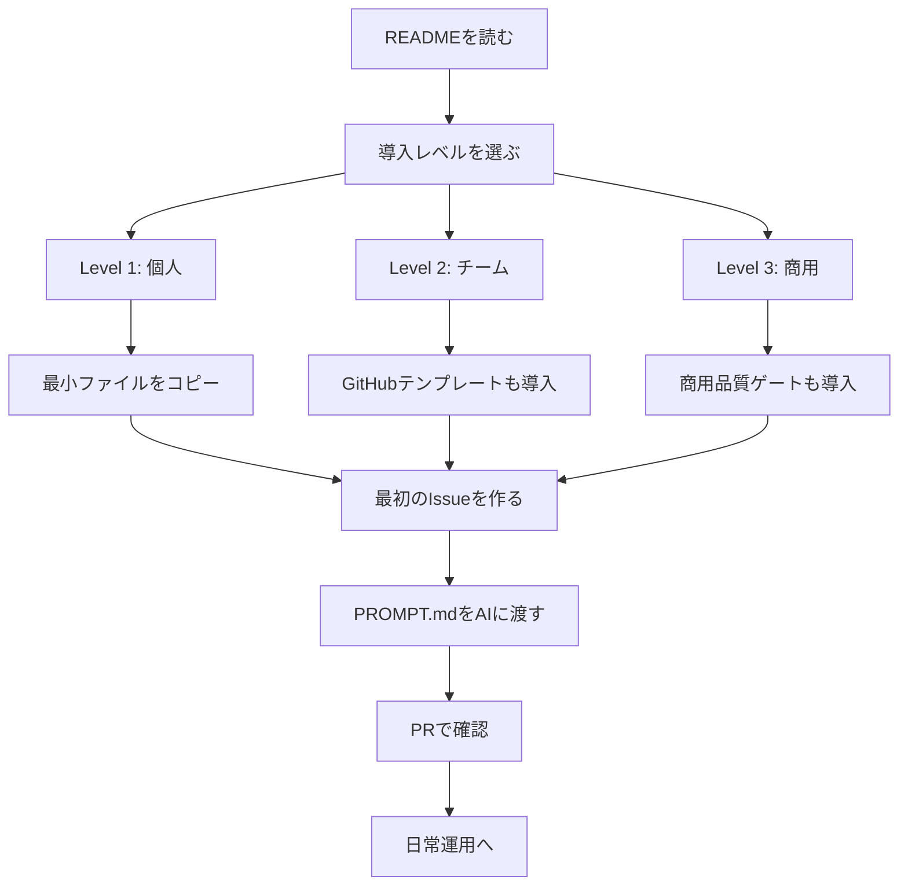

# Adoption Guide

AI Native Development Template を自分のRepositoryに導入するための完全ガイド

## このガイドの目的

このガイドは、READMEで全体像をつかんだあとに、実際に導入作業を進めるための手順書です。非エンジニア・AI初心者・学生でも迷わないよう、段階的に説明します。

## まず決めること

- 目的（学習 / 個人開発 / チーム開発 / 商用運用）
- 導入対象（既存Repository / 新規Repository）
- 導入レベル（Level 1 / 2 / 3）
- 運用ルール（日本語運用、ログ保存、ADR運用）

## 導入レベル診断

| 質問 | はいの場合 |
|---|---|
| まずは個人でAI開発を試したい | Level 1 |
| 学生チームや小規模チームで使いたい | Level 2 |
| 顧客に提供するサービスで使いたい | Level 3 |
| セキュリティや障害対応も管理したい | Level 3 |
| GitHub Actionsで自動チェックしたい | Level 2以上 |

## 導入フロー



## Level 1: 個人開発・学習向けの導入手順

1. `PROMPT.md` と `PROMPT.txt` をコピーする  
   なぜ必要か: AIへの依頼文を標準化し、毎回の説明コストを下げるためです。
2. `docs/templates/` をコピーする  
   なぜ必要か: Issue/PR/ログ/ADRの書き方を揃え、最初の運用負荷を下げるためです。
3. `docs/logs/` を作る  
   なぜ必要か: 作業の進捗・判断・次アクションを時系列で残すためです。
4. `docs/ai-prompts/` を作る  
   なぜ必要か: AIに何を指示したかを再現可能な形で残すためです。
5. READMEにAI開発ルールへのリンクを追加する  
   なぜ必要か: 自分や将来の共同作業者が、迷わずルールへ辿れるようにするためです。
6. 最初のIssueを作る  
   なぜ必要か: 目的・完了条件・スコープを明文化し、AIと認識合わせするためです。
7. AIにPROMPT.mdとIssue URLを渡す  
   なぜ必要か: 実行ルールと作業対象を同時に渡して、出力の一貫性を高めるためです。
8. 作業ログを保存する  
   なぜ必要か: 会話履歴に依存せず、Repository中心で再開可能にするためです。

## Level 2: チーム開発向けの導入手順

Level 1に加えて、以下を実施します。

1. `.github/pull_request_template.md` を導入する  
   なぜ必要か: PR説明を統一し、レビュー品質と速度を安定させるためです。
2. `.github/ISSUE_TEMPLATE/` を導入する  
   なぜ必要か: 課題起票時の情報不足を減らすためです。
3. `docs/core/` をコピーする  
   なぜ必要か: チーム運用・品質・意思決定ルールを共通化するためです。
4. `docs/adr/` を作る  
   なぜ必要か: 重要判断の背景を残し、後から見直せるようにするためです。
5. commit message日本語ルールを導入する  
   なぜ必要か: 変更履歴をチーム全員が読みやすい形に揃えるためです。
6. PR/Issue/Discussionの運用ルールをチームで合意する  
   なぜ必要か: 属人化を避け、AIと人間が同じ運用基準で動けるようにするためです。

## Level 3: 商用・本番運用向けの導入手順

Level 2に加えて、以下を実施します。

1. commercial readinessを導入する  
   なぜ必要か: 顧客提供前に必要な品質・契約・運用観点の抜け漏れを防ぐためです。
2. security rulesを導入する  
   なぜ必要か: 脆弱性対応や秘密情報管理を標準化するためです。
3. release managementを導入する  
   なぜ必要か: リリース判断基準とロールバック方針を明確化するためです。
4. incident responseを導入する  
   なぜ必要か: 障害時の連絡・復旧・再発防止を迅速に進めるためです。
5. support readinessを導入する  
   なぜ必要か: ユーザー問い合わせ対応や運用引き継ぎを安定化するためです。
6. GitHub Actionsやscriptsで自動チェックする  
   なぜ必要か: ヒューマンエラーを減らし、品質ゲートを継続運用するためです。
7. リリース前チェックリストを運用する  
   なぜ必要か: 「公開直前に慌てる」状態を防ぎ、再現可能な出荷手順を保つためです。

## 既存Repositoryへ導入する手順

1. 現在のディレクトリ構成・既存ルールを棚卸しする
2. 競合しない場所に `docs/ai-protocol/` を作成する
3. 導入レベルに合わせて必要ファイルのみ追加する
4. READMEに `adoption-guide` / `PROMPT.md` / `PROMPT.txt` の導線を追加する
5. 最初の導入PRを作成し、影響範囲を明記してレビューする

## 新規Repositoryへ導入する手順

1. 新規Repositoryを作成する
2. Level 1最小構成を先に配置する
3. READMEに目的と運用ポリシーを追加する
4. 初回Issueを作成し、最初のタスクを小さく切る
5. AIへ `PROMPT.md + Issue URL + 作業内容` を渡して着手する

## AIに導入作業を依頼する方法

```text
以下のAI Native Development Templateを、このRepositoryへ導入してください。

参照:
- PROMPT.md
- docs/adoption-guide.md

対象Repository:
{{REPOSITORY_URL}}

導入レベル:
{{LEVEL}}

目的:
{{PURPOSE}}

必須:
- README.mdに導線を追加
- docs/ai-protocol/ を作成
- PR / Issue / Discussion / commit message は日本語
- 作業ログを保存
- AIプロンプトログを保存
- 重要判断はADRへ保存
- 既存構成を壊さない
```

置き換え例:
- `{{REPOSITORY_URL}}` → `https://github.com/your-org/your-repo`
- `{{LEVEL}}` → `Level 2`
- `{{PURPOSE}}` → `チームのPR運用とAI依頼ルールを統一したい`

## 導入後に最初に作るIssue

- タイトル例: `AI開発プロトコル導入: Level 1最小構成の整備`
- 必須項目:
  - 背景
  - 目的
  - 完了条件
  - 除外範囲
  - レビュー観点

## 導入後に最初に作るPR

- タイトル例: `docs: AI開発プロトコル初期導入（Level 1）`
- 含める内容:
  - 追加・変更ファイル
  - 導入した運用ルール
  - 影響範囲
  - ロールバック方針

## 導入後の日常運用

1. Issueで目的と完了条件を定義
2. PROMPT.mdとIssue URLをAIへ渡す
3. 実装・修正後に作業ログを保存
4. AIプロンプトログを保存
5. 必要な判断はADRへ記録
6. PRを作成して日本語でレビュー

## 導入事例・利用シナリオ

### ケース1: 学生が個人開発で使う

- 目的: ポートフォリオ開発を安全に継続する
- 導入レベル: Level 1
- 使うファイル: `PROMPT.md`, `docs/templates/`, `docs/logs/`
- 最初に作るIssue: MVPの画面1つを実装するIssue
- AIへの依頼例: 「ログイン画面のUIを実装し、作業ログを残して」
- 完了条件: PR作成・ログ保存・次タスク定義が完了

### ケース2: AI初心者がCodexに開発を頼む

- 目的: AI依頼の型を固定し、失敗を減らす
- 導入レベル: Level 1
- 使うファイル: `PROMPT.txt`, `docs/adoption-guide.md`, `docs/templates/`
- 注意点: Issueなし依頼を避け、完了条件を先に書く
- AIへの依頼例: 「Issueの完了条件に沿って最小変更で実装して」

### ケース3: 小規模チームでPR運用を統一する

- 目的: レビューの粒度を揃え、引き継ぎを容易にする
- 導入レベル: Level 2
- 使うファイル: `.github/pull_request_template.md`, `.github/ISSUE_TEMPLATE/`, `docs/core/`
- PRテンプレート: 目的・変更点・テスト結果・リスクを必須化
- commit messageルール: 日本語で「何を/なぜ」を短く明記

### ケース4: 商用サービスを作る

- 目的: リリース品質と運用耐性を確保する
- 導入レベル: Level 3
- 使うファイル: `docs/core/commercial-readiness.md`, `docs/core/security-rules.md`, `docs/runbooks/incident-response.md`
- セキュリティ確認: secret管理・依存関係・脆弱性対応フロー
- リリース確認: Go/No-Go基準・ロールバック手順
- サポート確認: 問い合わせ導線・障害報告テンプレート

## よくある失敗と対策

| 失敗 | 対策 |
|---|---|
| PROMPT.mdだけコピーして終わる | 作業ログとAIプロンプトログも作る |
| READMEから導線がない | READMEにadoption-guideとPROMPT.mdへのリンクを置く |
| AIにIssueなしで依頼する | まずIssueで目的と完了条件を整理する |
| 最初からLevel 3を全部入れて重くなる | Level 1から始める |
| PR説明が薄い | PRテンプレートを使う |
| AIの出力をそのまま信じる | 人間レビューとテストを必須にする |

## 導入チェックリスト

### Level 1
- [ ] PROMPT.md を配置した
- [ ] PROMPT.txt を配置した
- [ ] docs/templates/ を配置した
- [ ] docs/logs/ を作成した
- [ ] docs/ai-prompts/ を作成した
- [ ] READMEからPROMPT.mdへリンクした
- [ ] 最初のIssueを作成した

### Level 2
- [ ] .github/pull_request_template.md を配置した
- [ ] .github/ISSUE_TEMPLATE/ を配置した
- [ ] docs/core/ を配置した
- [ ] docs/adr/ を作成した
- [ ] 日本語commit messageルールを追加した

### Level 3
- [ ] commercial readinessを導入した
- [ ] security rulesを導入した
- [ ] release managementを導入した
- [ ] incident responseを導入した
- [ ] support readinessを導入した
- [ ] 自動チェック方針を決めた

## 次に読むファイル

- [README.md](../README.md)
- [PROMPT.md](../PROMPT.md)
- [PROMPT.txt](../PROMPT.txt)
- [docs/examples/use-cases.md](./examples/use-cases.md)
- [docs/examples/adoption-examples.md](./examples/adoption-examples.md)
